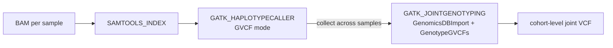

# 🧬 nf-dnaseq: Germline Variant Calling Pipeline

[](https://www.nextflow.io/)
[](https://www.docker.com/)
[](https://docs.conda.io/)
[](https://opensource.org/licenses/MIT)

## 📖 Introduction

**nf-dnaseq** is a portable germline short-variant calling pipeline written in
[Nextflow](https://www.nextflow.io) using **DSL2**. It wraps **Samtools** and **GATK4** to
call SNPs and indels from mapped whole-genome sequencing (BAM) data, using containerised
tools throughout.

The pipeline is built for reproducibility and portability: it runs the same way on a laptop,
an HPC cluster, or the cloud, via Docker, Singularity, or Conda.

## 🧩 Workflow Architecture

The pipeline uses a modular design: `main.nf` is a thin entry point that builds the input
channel from a samplesheet and delegates to the `DNASEQ_WORKFLOW` sub-workflow
(`workflows/dnaseq.nf`), which wires together three independent, single-purpose processes
defined under `modules/`.



Nextflow can also render the exact execution DAG for any given run (see
[Reproducibility](#-reproducibility) below).

## ⚡ Pipeline Summary

1. **Indexing**: generate a `.bai` index for each input BAM using `Samtools index`.
2. **Per-sample calling**: call variants per sample in GVCF mode using GATK `HaplotypeCaller`.
3. **Joint genotyping**: combine all per-sample GVCFs into a GenomicsDB data store with
   `GenomicsDBImport`, then run `GenotypeGVCFs` to produce one cohort-level VCF.

| Process                | Tool(s)                                  | Container                                                            |
|-------------------------|-------------------------------------------|------------------------------------------------------------------------|
| `SAMTOOLS_INDEX`        | Samtools `index`                          | `community.wave.seqera.io/library/samtools:1.20--b5dfbd93de237464`     |
| `GATK_HAPLOTYPECALLER`  | GATK `HaplotypeCaller` (`-ERC GVCF`)      | `community.wave.seqera.io/library/gatk4:4.5.0.0--730ee8817e436867`     |
| `GATK_JOINTGENOTYPING`  | GATK `GenomicsDBImport` + `GenotypeGVCFs` | `community.wave.seqera.io/library/gatk4:4.5.0.0--730ee8817e436867`     |

## 🧬 Dataset & Reference

The bundled test dataset under `data/` is a **family trio** (mother, father, son; mapped
Illumina short-read WGS data) subset to a small slice of **chromosome 20** (hg19/b37), so the
whole pipeline runs in seconds. It's the official dataset from the Nextflow
["Nextflow for Science: Genomics"](https://training.nextflow.io/latest/nf4_science/genomics/)
training course — see [Credits](#️-credits).

For your own data, point `--input` at a samplesheet like `assets/samplesheet.csv`:

```csv
sample_id,reads_bam
SAMPLE1,/path/to/sample1.bam
SAMPLE2,/path/to/sample2.bam
```

## 🛡️ Validation & Reliability

- **Fail-fast checks**: the samplesheet and every reference file are validated with
  `checkIfExists: true`, and the workflow raises a clear error if no samples are found —
  before any container is pulled or any compute is spent.
- **Modular DSL2**: `main.nf` → `workflows/dnaseq.nf` → `modules/*.nf` — independent process
  definitions that are easy to test, swap, or extend in isolation.
- **Resource tiers**: processes are labelled `process_low` / `process_medium`, with
  `cpus`/`memory` set centrally in `nextflow.config` rather than hardcoded per-process.
- **Automatic retry**: processes killed by an out-of-memory or termination signal
  (exit codes 137/139/143) are retried automatically before the run is allowed to fail.

## 🚀 Quick Start

1. **Prerequisites**: [Nextflow](https://www.nextflow.io/docs/latest/install.html) (>=24.10.0)
   and **Docker** (or Conda/Singularity — see below).

2. **Clone the repository**:

   ```bash
   git clone https://github.com/<your-username>/nf-dnaseq.git
   cd nf-dnaseq
   ```

3. **Run on the bundled test data**:

   ```bash
   nextflow run main.nf -profile test,docker
   ```

4. **Run on your own samples**:

   ```bash
   nextflow run main.nf \
       --input           samplesheet.csv \
       --reference       ref.fasta \
       --reference_index ref.fasta.fai \
       --reference_dict  ref.dict \
       --intervals       intervals.bed \
       --cohort_name     my_cohort \
       -profile docker \
       -resume
   ```

### Parameters

| Parameter          | Description                                                          |
|---------------------|----------------------------------------------------------------------|
| `input`             | CSV samplesheet listing `sample_id,reads_bam`                        |
| `reference`         | Reference genome FASTA                                               |
| `reference_index`   | Reference `.fai` index                                               |
| `reference_dict`    | Reference sequence dictionary (`.dict`)                              |
| `intervals`         | BED file of genomic intervals to call variants over                  |
| `cohort_name`       | Name used for the final joint-called VCF                             |
| `outdir`            | Directory results are published to (default: `results`)              |

## 📦 Reproducibility

To ensure results can be replicated across environments, this pipeline supports three
interchangeable execution profiles, and every tool runs in a version-pinned container/env
either way:

- **`-profile docker`** (default) — Biocontainers/Seqera Wave images, pinned by tag.
- **`-profile singularity`** — the same containers, for HPC clusters without Docker.
- **`-profile conda`** — environment definitions in `envs/*.yml`, for institutional systems
  where no container runtime is available at all.

Combine with `-profile test` to layer the bundled dataset on top of any of the three.

Every run also writes a full audit trail to `results/pipeline_info/`:

- `trace.txt` — per-task resource usage and exit status
- `timeline.html` — visual execution timeline
- `execution_report.html` — full run report
- `pipeline_dag.html` — the resolved execution graph for that exact run

## 📂 Output Structure

```
results/
├── indexed_bam/                 # each input BAM + its .bai index
├── gvcf/                        # per-sample GVCFs (*.g.vcf) + indices
├── <cohort_name>.joint.vcf      # final cohort-level joint-genotyped VCF
├── <cohort_name>.joint.vcf.idx
└── pipeline_info/                # trace, timeline, report, DAG
```

## ⚠️ Known limitations

This pipeline follows solid DSL2 structure and reproducibility conventions (modular
processes, pinned containers, multiple execution profiles, fail-fast checks, execution
reports, automatic retries). It does **not** yet meet full [nf-core](https://nf-co.re/)
guidelines. Specifically still missing:

- Automated tests (`nf-test`) and CI (e.g. GitHub Actions running `-profile test` on push)
- A `nextflow_schema.json` for structured `--help` and parameter validation
- Per-process `versions.yml` emission for exact tool-version provenance
- Containers pinned by SHA256 digest rather than tag (tags on Seqera Wave are effectively
  immutable, but digest pinning is the only fully airtight guarantee)

## ✍️ Credits

Pipeline commands and dataset adapted from the Nextflow
["Nextflow for Science: Genomics"](https://training.nextflow.io/latest/nf4_science/genomics/)
training course (© Seqera, [CC BY-NC-SA 4.0](https://creativecommons.org/licenses/by-nc-sa/4.0/)).
Project layout conventions (`workflows/`, `envs/`, `assets/`, resource labels, multi-profile
execution) follow the structure of
[mujtababarsi/Human-RNAseq-nf-dsl2](https://github.com/mujtababarsi/Human-RNAseq-nf-dsl2).

## License

Pipeline code in this repository is released under the MIT License (see `LICENSE`).
