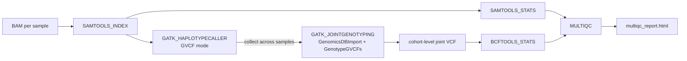

# Human-DNAseq-chr20-nf-dsl2: Human Chr20 Germline Variant Calling Pipeline

[](https://www.nextflow.io/)
[](https://github.com/mujtababarsi/Human-DNAseq-chr20-nf-dsl2/actions/workflows/ci.yml)
[](https://www.docker.com/)
[](https://opensource.org/licenses/MIT)

## Introduction

**Human-DNAseq-chr20-nf-dsl2** is a portable germline short-variant calling pipeline written in
[Nextflow](https://www.nextflow.io) using **DSL2**. It wraps **Samtools** and **GATK4** to
call SNPs and indels from mapped whole-genome sequencing (BAM) data, using containerised
tools throughout.

The pipeline is built for reproducibility and portability. It has Docker, Singularity and Conda profiles. So far it has been run with Docker, locally and on GitHub Actions.

## Workflow Architecture

The pipeline uses a modular design: `main.nf` is a thin entry point that builds the input
channel from a samplesheet and delegates to the `DNASEQ_WORKFLOW` sub-workflow
(`workflows/dnaseq.nf`), which wires together six independent, single-purpose processes
defined under `modules/`.


```mermaid
flowchart LR
    A[BAM per sample] --> B[SAMTOOLS_INDEX]
    B --> C[GATK_HAPLOTYPECALLER<br/>GVCF mode]
    B --> Q1[SAMTOOLS_STATS]
    C -- collect across samples --> D[GATK_JOINTGENOTYPING<br/>GenomicsDBImport + GenotypeGVCFs]
    D --> E[cohort-level joint VCF]
    E --> Q2[BCFTOOLS_STATS]
    Q1 --> M[MULTIQC]
    Q2 --> M
    M --> R[multiqc_report.html]
```

Nextflow also renders the exact execution DAG for any given run automatically (see
[Quality Control & Execution Reports](#quality-control--execution-reports) below).

## Pipeline Summary

1. **Indexing**: generate a `.bai` index for each input BAM using `Samtools index`.
2. **Per-sample calling**: call variants per sample in GVCF mode using GATK `HaplotypeCaller`.
3. **Joint genotyping**: combine all per-sample GVCFs into a GenomicsDB data store with
   `GenomicsDBImport`, then run `GenotypeGVCFs` to produce one cohort-level VCF.
4. **QC**: alignment QC per sample (`samtools stats`/`flagstat`) and variant-calling QC on
   the joint VCF (`bcftools stats`), aggregated into one interactive `MultiQC` report.

| Process                | Tool(s)                                  | Container                                                            |
|-------------------------|-------------------------------------------|------------------------------------------------------------------------|
| `SAMTOOLS_INDEX`        | Samtools `index`                          | `community.wave.seqera.io/library/samtools:1.20--b5dfbd93de237464`     |
| `GATK_HAPLOTYPECALLER`  | GATK `HaplotypeCaller` (`-ERC GVCF`)      | `community.wave.seqera.io/library/gatk4:4.5.0.0--730ee8817e436867`     |
| `GATK_JOINTGENOTYPING`  | GATK `GenomicsDBImport` + `GenotypeGVCFs` | `community.wave.seqera.io/library/gatk4:4.5.0.0--730ee8817e436867`     |
| `SAMTOOLS_STATS`        | Samtools `stats` + `flagstat`             | `community.wave.seqera.io/library/samtools:1.20--b5dfbd93de237464`     |
| `BCFTOOLS_STATS`        | Bcftools `stats`                          | `quay.io/biocontainers/bcftools:1.23.1--hb2cee57_0`                    |
| `MULTIQC`               | MultiQC                                   | `quay.io/biocontainers/multiqc:1.27--pyhdfd78af_0`                     |

## Dataset & Reference

The bundled test dataset under `data/` is a **family trio** (mother, father, son; mapped
Illumina short-read WGS data) subset to a small slice of **chromosome 20** (hg19/b37), so the
whole pipeline runs quickly. It's the official dataset from the Nextflow
["Nextflow for Science: Genomics"](https://training.nextflow.io/latest/nf4_science/genomics/)
training course (see [Credits](#credits)).

For your own data, point `--input` at a samplesheet like `assets/samplesheet.csv`:

```csv
sample_id,reads_bam
SAMPLE1,/path/to/sample1.bam
SAMPLE2,/path/to/sample2.bam
```

## Validation & Reliability

- **Fail-fast checks**: the samplesheet and every reference file are validated with
  `checkIfExists: true`, and the workflow raises a clear error if no samples are found,
  before any container is pulled or any compute is spent.
- **Modular DSL2**: `main.nf` → `workflows/dnaseq.nf` → `modules/*.nf`, with independent process
  definitions that are easy to test, swap, or extend in isolation.
- **Resource tiers**: processes are labelled `process_low` / `process_medium`, with
  `cpus`/`memory` set centrally in `nextflow.config` rather than hardcoded per-process.
- **Automatic retry**: processes killed by an out-of-memory or termination signal
  (exit codes 137/139/143) are retried automatically before the run is allowed to fail.

## Quick Start

1. **Prerequisites**: [Nextflow](https://www.nextflow.io/docs/latest/install.html) (>=25.10.0) and **Docker** (see [Reproducibility](#reproducibility) for the other profiles).

2. **Clone the repository**:

   ```bash
   git clone https://github.com/mujtababarsi/Human-DNAseq-chr20-nf-dsl2.git
   cd Human-DNAseq-chr20-nf-dsl2
   ```

3. **Run on the bundled test data**:

   ```bash
   nextflow run main.nf -profile test,docker
   ```

4. **Run on your own samples**:

   ```bash
   nextflow run main.nf \
       --input           samplesheet.csv \
       --reference       ref.fasta \
       --reference_index ref.fasta.fai \
       --reference_dict  ref.dict \
       --intervals       intervals.bed \
       --cohort_name     my_cohort \
       -profile docker \
       -resume
   ```

### Parameters

| Parameter          | Description                                                          |
|---------------------|----------------------------------------------------------------------|
| `input`             | CSV samplesheet listing `sample_id,reads_bam`                        |
| `reference`         | Reference genome FASTA                                               |
| `reference_index`   | Reference `.fai` index                                               |
| `reference_dict`    | Reference sequence dictionary (`.dict`)                              |
| `intervals`         | BED file of genomic intervals to call variants over                  |
| `cohort_name`       | Name used for the final joint-called VCF                             |
| `outdir`            | Directory results are published to (default: `results`)              |

Parameters are validated against [`nextflow_schema.json`](nextflow_schema.json) on every run
(missing/malformed inputs fail immediately, before any container is pulled). Run with
`--help` for the full usage message, generated from the same schema:

```bash
nextflow run main.nf --help
```

## Testing

The pipeline has an [nf-test](https://www.nf-test.com/) suite covering three of the six
processes, the `DNASEQ_WORKFLOW` sub-workflow, and a full end-to-end run:

```
tests/
├── main.nf.test                          # full pipeline, -profile test equivalent
├── workflows/dnaseq.nf.test               # sub-workflow: 3 samples in, joint VCF out + fail-fast check
└── modules/
    ├── samtools_index.nf.test
    ├── samtools_stats.nf.test
    └── gatk_haplotypecaller.nf.test
```

Install [nf-test](https://www.nf-test.com/installation/) and run the whole suite with:

```bash
nf-test test --profile docker
```

On every push and pull request, CI (`.github/workflows/ci.yml`) runs the `-profile test,docker`
smoke test against the minimum supported Nextflow version (25.10.0) and the latest release,
and runs the full `nf-test` suite on 25.10.0.

## Reproducibility

The pipeline has three execution profiles. In each one, every tool runs in a version-pinned
container or environment:

- **`-profile docker`** (default): Biocontainers/Seqera Wave images, pinned by tag.
- **`-profile singularity`**: the same containers, for HPC clusters without Docker (not tested yet).
- **`-profile conda`**: environment definitions in `envs/*.yml`, for systems with no container
  runtime at all (not tested yet).

Combine with `-profile test` to layer the bundled dataset on top of any of the three.

## Quality Control & Execution Reports

Every run produces two kinds of report automatically, with nothing extra to run:

**QC report** (biological QC, i.e. "did the sequencing/calling look right?"):
`samtools stats`/`flagstat` per sample plus `bcftools stats` on the joint VCF are aggregated
by MultiQC into one dashboard:

```
results/qc/multiqc/multiqc_report.html
```

**Execution reports** (operational, i.e. "how did the run itself behave?"), written to
`results/pipeline_info/` on every invocation:

- `trace.txt`: per-task resource usage and exit status
- `timeline.html`: visual execution timeline
- `execution_report.html`: full run report
- `pipeline_dag.html`: the resolved execution DAG for that exact run

Both are switched on in `nextflow.config` (the `dag`, `timeline`, `report` and `trace` blocks),
so just run the pipeline normally and open the HTML files afterwards:

```bash
nextflow run main.nf -profile test,docker
open results/qc/multiqc/multiqc_report.html        # QC dashboard
open results/pipeline_info/pipeline_dag.html        # execution DAG
```

(use `xdg-open` instead of `open` on Linux)

## Output Structure

```
results/
├── indexed_bam/                          # each input BAM + its .bai index
├── gvcf/                                 # per-sample GVCFs (*.g.vcf) + indices
├── <cohort_name>.joint.vcf               # final cohort-level joint-genotyped VCF
├── <cohort_name>.joint.vcf.idx
├── qc/
│   ├── samtools/                         # per-sample *.stats.txt + *.flagstat.txt
│   ├── bcftools/                         # <cohort_name>.bcftools_stats.txt
│   └── multiqc/
│       ├── multiqc_report.html           # aggregated QC dashboard
│       └── multiqc_data/
└── pipeline_info/                        # trace, timeline, report, DAG
```

## Known limitations

- Tested only on a chr20 trio (mother, father, son). It hasn't been run on a whole genome yet.
- It starts from aligned BAM files, so it doesn't do alignment, duplicate marking or base
  quality score recalibration (BQSR).
- It has been run end to end with Docker, locally and on GitHub Actions, where the nf-test
  suite passes. The Singularity and Conda profiles haven't been tested, and it hasn't been
  run on an HPC cluster.
- It doesn't yet meet every [nf-core](https://nf-co.re/) guideline. Still missing:
  - per-process `versions.yml` files recording exact tool versions (for now, the container
    tags in `modules/*.nf` are the record)
  - containers pinned by SHA256 digest rather than by tag
  - a full `nf-core pipelines lint` pass

## Credits

Pipeline commands and dataset adapted from the Nextflow
["Nextflow for Science: Genomics"](https://training.nextflow.io/latest/nf4_science/genomics/)
training course (© Seqera, [CC BY-NC-SA 4.0](https://creativecommons.org/licenses/by-nc-sa/4.0/)).
Project layout conventions (`workflows/`, `envs/`, `assets/`, resource labels, multi-profile
execution) follow the structure of
[mujtababarsi/Human-RNAseq-nf-dsl2](https://github.com/mujtababarsi/Human-RNAseq-nf-dsl2).

## License

Pipeline code in this repository is released under the MIT License (see `LICENSE`).
